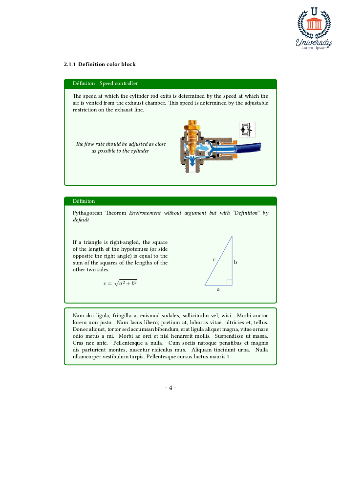

# Latex Template for University

LaTeX Template made by myself for my course summaries, my practical work reports or my project files reports (including electrical implementation diagrams, C or  Natural language or over programming language like ST (industry automation) etc...)

> The general shape of the rendering is done with the **KOMA-SCRIPT class scrartcl** (European version of standart class "Article" especially to adapt the layout to A4 format and over benefits)

# Table of Contents

- [Latex Template for University](#latex-template-for-university)
- [Table of Contents](#table-of-contents)
- [Preview](#preview)
- [Want to reproduce ?](#want-to-reproduce-)
- [Installation guide of LaTeX for begginers](#installation-guide-of-latex-for-begginers)
  - [TeXLive](#texlive)
  - [Development environment](#development-environment)
- [Installation guide of the Template](#installation-guide-of-the-template)
- [How to configure VSCode to code in LaTeX](#how-to-configure-vscode-to-code-in-latex)
  - [First: download VSCode](#first-download-vscode)
  - [Second: Install extensions](#second-install-extensions)
- [Packages included in the Template](#packages-included-in-the-template)
- [Custom Template environements](#custom-template-environements)
- [Credits](#credits)
- [License](#license)

# Preview

| Custom Title Page | Simple Page Presentation |
| :---------------: | :----------------------: |
| [](examples/simple-example/simpleExample.pdf) | [](examples/simple-example/simpleExample.pdf) |

# Want to reproduce ?

**You are totally free to clone this repository to adapt at your own purpose !**

*Differents "How-To" will follow in the next sections depending on whether you are a new or experienced LaTeX user.*

# Installation guide of LaTeX for begginers

## TeXLive

- For Linux Users :
> You can install TeXLive by running ```sudo apt install texlive-full``` under Linux environement *(Be carreful, the total installation is about 5GB, you can make a partial installation and download packages needed later)*

- For others Systems :
> You can install it directly on the official website "http://www.tug.org/texlive/acquire-netinstall.html" by following the procedure.

## Development environment

:warning: **I recommend that you first find out about the different IDEs BEFORE choosing**

You can use differents IDE for Latex :

- You can use [TeXStudio](https://www.texstudio.org/). TeXstudio is an integrated writing environment made for creating LaTeX documents.
> TeXStudio is a ready-to-use editor for LaTeX that makes it easy to get started.

- You can use [Vim](https://www.vim.org/). Vim is a highly configurable text editor.
> Vim is difficult to use for begginner and not recommended for the uninitiated 
> 
> **but you can read [this guide](https://medium.com/rahasak/vim-as-my-latex-editor-f0c5d60c66fa)**

- You can use [Visual Studio Code](https://code.visualstudio.com/). Visual Studio Code is an extensible code editor developed by Microsoft.
> **This is the solution I am developing in the ["How-to configure VSCode for LaTeX"](#how-to-configure-vscode-to-code-in-latex)**

- And finally : Feel free to choose you own workflow, you can find many guides to take notes and other with LaTeX on the internet.
# Installation guide of the Template


Then you can build the template directly without errors!

But you still have to personalise the data :

1. Add a ```./assets/logo.png``` for you own logo and repositionning correctly it at the line ```17``` by changing the values of ```hshift=``` and ```vshift=```
> 

2. Changing ```\firstName```, ```\lastName```, ```\university``` commands values and adapt ```\groupNumber``` to your own situation
> 

3. Make the rest of the features your own with the ["Custom Template environments"](#custom-template-environements) and ["Packages included in the Template"](#packages-included-in-the-template) sections !

# How to configure VSCode to code in LaTeX

For my setup I use VS Code and Vim to write my documents in LaTeX.

But I also use differents extensions to facilitate some actions like graph drawing with [Draw.io](https://app.diagrams.net/)
## First: download VSCode

> Download VSCode [here.](https://code.visualstudio.com/)

## Second: Install extensions
# Packages included in the Template

# Custom Template environements

# Credits

# License